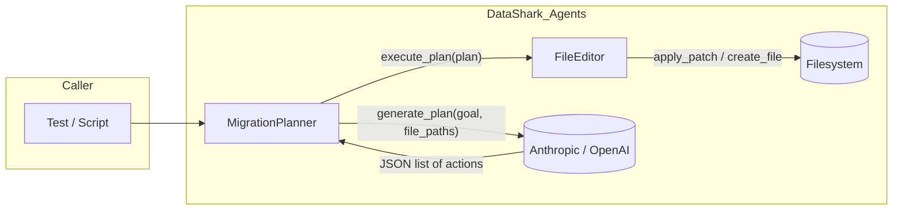

# DataShark Agents — Context Packet

**Purpose:** Single evidence-based reference for how the agent system works in this repo: frameworks, routing, tools, state, eval gates, and integration with the main DataShark repo.  
**Scope:** DataShark_Agents repository only. “Core” = parent DataShark repo (`../`).  
**Generated:** 2025-02-11 (evidence from repo inspection).

---

## 1. Repo Snapshot

| Item | Value |
|------|--------|
| **Branch** | `main` |
| **Commit** | `c2fbb7aba7d9033c734abce1d9f9f58287c279bf` |
| **Last commit** | `c2fbb7a feat: V0 Release - Operational Ingestion & Chat (SQL Only)` |
| **Dirty?** | Yes. Modified: `.gitignore`, `.keep`, `run_watcher.py`, `src/chat/repl.py`, `src/ingestion/watcher.py`; deleted: `"Ingestion Strategy.md"`; modified in parent: `../src/datashark/...`, `../src/datashark/core/types.py`. Untracked: `_management_documents/`, `logs/`, `scenarios/`, `src/agent/`, `src/graph/`, `src/shared/audit_anthropic.py`, `src/shared/diagnostics.py`, `tests/`, `../ARCHITECTURAL_SUMMARY.md`, `../_management_documents/TECHNICAL_STATE_OF_THE_UNION_AUDIT.md`. |
| **Remotes** | `origin` → `https://github.com/ConvergentMethods/DataShark.git` (fetch/push) |
| **Primary runtimes** | Python 3.x (no `pyproject.toml` or `requirements.txt` in this repo; parent has `pyproject.toml` and `requirements.txt`) |
| **Build system** | None in DataShark_Agents; parent uses setuptools (`pyproject.toml`, `setup.py`). |

---

## 2. Quickstart (Verified)

### Install (Mac)

- No dedicated install manifest in DataShark_Agents. Dependencies are implied by imports; parent repo has the canonical Python env.
- **Recommended:** From repo root, use parent’s venv and install parent deps, then ensure Agents-specific deps are available:
  - **Agents-only deps** (from code): `anthropic`, `openai`, `python-dotenv`, `lancedb`, `pyarrow`, `sentence_transformers`. Not declared in this repo; add locally or rely on parent if unified.
- If `.venv` exists at project root, activate it before commands.

### Run a minimal agent session

- **Migration Architect (plan only):**
  ```bash
  cd DataShark_Agents
  # set ANTHROPIC_API_KEY or OPENAI_API_KEY
  python -m src.agent.planner
  ```
  **Caveat:** `src/agent/planner.py` uses `os.getenv("ANTHROPIC_API_KEY")` at line 222 but does not `import os` (bug). Either add `import os` or run via test below.

- **Migration Architect (plan + execute, both providers):**
  ```bash
  cd DataShark_Agents
  export ANTHROPIC_API_KEY=... OPENAI_API_KEY=...
  python tests/verify_architect.py
  ```
  Resets `scenarios/dummy_fix.sql`, generates a plan (“Rename table alias 'u' to 'users'”), executes patches via `FileEditor`, verifies file content. This is the **verified** minimal agent run.

### Run tests/evals

- **Architect verification:** `python tests/verify_architect.py` — runs E2E for Anthropic and OpenAI; no pytest discovery in this repo.
- **Diagnostics:** `python -m src.shared.diagnostics` — checks API keys and OpenAI/Anthropic connectivity.
- **Usage/cost:** `test_connection.py` — one-off Anthropic ping + `UsageTracker` log.

### Known failures with excerpts

- **`python -m src.agent.planner`:** Fails at `os.getenv(...)` if `import os` is missing (`NameError: name 'os' is not defined`). Evidence: `src/agent/planner.py` lines 222–223, no `import os` in file.
- **`run_watcher.py`:** Fails at import or instantiation: `src/ingestion/watcher.py` is **empty** (no `Watcher` class). `run_watcher.py` does `from src.ingestion.watcher import Watcher` and `watcher.start(TARGET_DIR)`. Evidence: `src/ingestion/watcher.py` is empty; `_management_documents/ARCHITECTURAL_SUMMARY.md` §2.2.

---

## 3. Agent System Overview (As Implemented)

**End-to-end:** This repo implements **one operational agent**, the **Migration Architect**: a single-shot planner that takes a high-level migration/refactor goal and a list of repo-relative file paths, calls one LLM (Anthropic Claude or OpenAI GPT-4o) to produce a **strict JSON list of edit actions** (`UPDATE` with `file`/`search`/`replace`), then executes those edits via a **FileEditor** (safe search/replace and create-file under a workspace root). There is **no** LLM function-calling: the model returns JSON; the planner parses it and calls the editor from Python. Chat/REPL and ingestion watcher are placeholders (empty modules). There is no router, no multi-agent orchestration, and no integration with the main DataShark Core (graph, SQL kernel, or MCP).

**Orchestration diagram (Mermaid):**



**Main abstractions (mapped to code):**

| Abstraction | Implementation | Location |
|-------------|-----------------|----------|
| **Agent** | Migration Architect = MigrationPlanner + FileEditor | `src/agent/planner.py`, `src/agent/editor.py` |
| **Tool** | FileEditor: `apply_patch`, `create_file` (Python API; not LLM tools) | `src/agent/editor.py` |
| **Memory** | None for the Architect. VectorStore + LocalEmbedder exist for RAG but are not wired into any agent flow. | `src/shared/store.py`, `src/shared/embedder.py` |
| **Router** | None. Caller chooses provider when constructing MigrationPlanner. | N/A |
| **Policy** | Workspace scoping (path under `workspace_root`), backup-before-write, exact-match replace only. | `src/agent/editor.py` |
| **Evaluator** | Single E2E script: `tests/verify_architect.py` (plan + execute + content assertion). No golden suite or regression harness in repo. | `tests/verify_architect.py` |

---

## 4. Frameworks & Dependencies

- **No third-party agent framework** (no LangChain, LangGraph, CrewAI, AutoGen, etc.). Implementation is **custom**: Python classes, direct SDK calls, in-memory execution. Evidence: `_management_documents/ARCHITECTURAL_SUMMARY.md` line 149; grep shows no `langgraph`/`langchain` imports.
- **Libraries used (from imports):**
  - **LLM:** `anthropic`, `openai` — used in `src/agent/planner.py`, `src/shared/diagnostics.py`, `src/shared/audit_anthropic.py`, `tests/verify_architect.py`.
  - **Vector/RAG:** `lancedb`, `pyarrow` in `src/shared/store.py`; `sentence_transformers` in `src/shared/embedder.py`. Not used by the Architect.
  - **Env:** `python-dotenv` in `diagnostics`, `audit_anthropic`, `test_connection`.
- **Provider abstraction:** None. Caller passes either an `Anthropic` or `OpenAI` client and sets `model_provider="anthropic"` or `"openai"`. Planner branches on `self.provider` to call the appropriate API. Evidence: `src/agent/planner.py` lines 39–41, 106–136.
- **Version pinning / lockfiles:** No `requirements.txt`, `poetry.lock`, or `pyproject.toml` in DataShark_Agents. Parent has `pyproject.toml` and `requirements.txt` (see Appendix).

---

## 5. Routing & Control

- **Model routing:** No cost/latency/fallback logic. Caller selects provider and model at construction:
  - Anthropic: `claude-3-haiku-20240307` (constant `MODEL` in `planner.py` line 22).
  - OpenAI: `gpt-4o` (hardcoded in `planner.py` line 111).
- **Agent routing:** No dispatcher or specialist handoffs. Single agent (Migration Architect); invocation is direct Python (e.g. `verify_architect.run_test(provider)`).
- **Error handling and retry:** Planner returns `[]` on JSON parse failure (`_parse_json_response`). No retries on API or editor failures. FileEditor returns `False` on ambiguous/missing patch; planner logs and continues. Evidence: `src/agent/planner.py` 141–174, 186–206.

---

## 6. Tooling Contract Surface

- **Tool definitions location:** Tools are Python APIs only. No LLM function-calling schema.
  - **FileEditor:** `src/agent/editor.py` — `apply_patch(file_path, search_block, replace_block) -> bool`, `create_file(file_path, content) -> None`.
- **Input/output:** Editor expects repo-relative `file_path`; `search_block` must be an exact substring (single occurrence). Planner output contract: list of dicts `{"action": "UPDATE", "file": str, "search": str, "replace": str}`. Only `UPDATE` is executed; other action types are skipped with a log line. Evidence: `src/agent/planner.py` 93–99, 186–206; `src/agent/editor.py` 57–84, 86–99.
- **Validation:** Planner parses JSON and normalizes (strip markdown fences, accept top-level list or `{"plan": list}`). No Pydantic or JSON Schema in this repo for tool payloads.
- **Allowlists / sandbox:** Editor restricts all operations to paths under `workspace_root` (resolve and `relative_to` check); refuses to create or patch outside. Evidence: `src/agent/editor.py` 33–45, 69–70, 94–95.
- **Observability:** No structured logs or metrics for tool calls. `execute_plan` returns a list of human-readable log strings. Usage/cost tracked separately via `UsageTracker` (CSV) where explicitly used (e.g. `test_connection.py`), not in the planner.

---

## 7. State, Memory, Persistence

- **Conversation / session state:** None. Planner is stateless per run; no conversation history or session store.
- **Vector store:** LanceDB at `data/lancedb` (from `src/shared/store.py`), fixed 384-d schema. Used for RAG-ready storage only; no pipeline in this repo fills or queries it from an agent. Evidence: `_management_documents/ARCHITECTURAL_SUMMARY.md` §4, §2.2.
- **Checkpointing / replay / caching:** None. No checkpoint or replay for the Architect; no response caching or determinism layer.

---

## 8. Prompt & Policy Management

- **Prompts:** Inline in `MigrationPlanner.generate_plan`: system prompt (Senior Data Architect, JSON-only output) and user prompt (goal + file contents + strict JSON schema). No separate template files or versioning. Evidence: `src/agent/planner.py` 80–104.
- **Safety / output validation:** Planner enforces JSON list shape and normalizes code fences; invalid or non-list JSON yields `[]`. No red-team or guardrail components in repo. Editor enforces workspace boundary and exact-match replace to avoid arbitrary overwrites.

---

## 9. Evaluation Harness

- **Golden suites / scenario runner:** None. Single scenario: `scenarios/dummy_fix.sql` used by `verify_architect.py` with a fixed goal (“Rename table alias 'u' to 'users'”).
- **Regression tests:** `tests/verify_architect.py` is the only test entry; it runs both providers in sequence and asserts final file content contains `SELECT * FROM users`. No pytest discovery elsewhere documented.
- **Determinism:** No seed control, snapshotting, or response caching. LLM output is non-deterministic; test passes if the model produces a valid plan that achieves the assertion.
- **Metrics:** No correctness/latency/cost or tool-success metrics collected in repo. Cost logging is ad hoc via `UsageTracker` where wired (e.g. `test_connection.py`).

---

## 10. Integration With Main DataShark Repo

- **Current integration mechanism:** **None.** No code imports from DataShark Core into DataShark_Agents. No shared Python packages, no API client to Core server, no use of Core’s SemanticGraph, QueryPlanner, or SQL kernel. Evidence: `_management_documents/ARCHITECTURAL_SUMMARY.md` line 166; grep shows no imports from `datashark` in DataShark_Agents.
- **Assumed upstream contracts:** None. Agents repo is standalone. Parent has Core (e.g. `src/datashark/`, MCP, server, planner, graph); Agents does not assume any specific API or ingestion output from Core.
- **Gaps/blockers for production integration:** (1) No shared dependency or install story (Agents deps not in parent’s pyproject). (2) No documented contract (e.g. “Agents as plugin to Core” vs standalone). (3) Unifying would require an integration layer (e.g. Core API client or shared lib) and possibly moving or duplicating Agents into parent’s tree or CI.

---

## 11. Key Files & Directories (Annotated)

| Path | Role | Why it matters | Notes |
|------|------|----------------|--------|
| `src/agent/planner.py` | MigrationPlanner | Only LLM agent: goal → JSON plan → execute | Anthropic + OpenAI branches; `os.getenv` bug in `main()` |
| `src/agent/editor.py` | FileEditor | Safe file edits (patch/create) | Workspace-scoped; backup before write |
| `src/agent/__init__.py` | Package marker | — | No exports |
| `src/chat/repl.py` | Chat/REPL | Placeholder | Empty |
| `src/graph/__init__.py` | Graph integration | Placeholder | Empty |
| `src/ingestion/watcher.py` | Ingestion watcher | Intended entry for watch+embed+store | Empty; no Watcher class; run_watcher fails |
| `src/ingestion/__init__.py` | Package marker | — | Docstring only |
| `run_watcher.py` | CLI for watcher | Would start Watcher + VectorStore + Embedder | Fails: Watcher undefined |
| `src/shared/store.py` | VectorStore | LanceDB 384-d vectors | Not used by any agent path |
| `src/shared/embedder.py` | LocalEmbedder | sentence-transformers all-MiniLM-L6-v2 | Not used by any agent path |
| `src/shared/usage.py` | UsageTracker | CSV cost log | Used in test_connection; not in planner |
| `src/shared/diagnostics.py` | Key + API checks | OpenAI/Anthropic connectivity | Standalone script |
| `src/shared/audit_anthropic.py` | Model ID probe | Anthropic model availability | Standalone script |
| `tests/verify_architect.py` | E2E verification | Only automated agent test; both providers | Resets dummy_fix.sql; asserts content |
| `scenarios/dummy_fix.sql` | Fixture | Target file for verify_architect | Small SQL file |
| `test_connection.py` | One-off | Anthropic ping + UsageTracker | Not part of test suite |
| `_management_documents/ARCHITECTURAL_SUMMARY.md` | Architecture | Canonical summary of repo | References Core; lists tools, agents, gaps |
| `_management_documents/AGENTIC_STACK_DEEP_DIVE.md` | Deep-dive | Orchestration, graph, MCP, state | Cross-repo view |

---

## 12. Known Issues & Near-Term TODOs

- **`planner.main()` uses `os.getenv` without `import os`** — `src/agent/planner.py` line 222; causes `NameError` when run as `python -m src.agent.planner`. Fix: add `import os` at top.
- **`src/ingestion/watcher.py` is empty** — `Watcher` class missing; `run_watcher.py` fails on import or at `watcher.start()`. Either implement Watcher or remove/guard the run_watcher entry.
- **No single dependency manifest in DataShark_Agents** — Dependencies are implied by imports (anthropic, openai, lancedb, pyarrow, sentence_transformers, python-dotenv). Adding a local `requirements.txt` or listing in parent’s `pyproject.toml` would clarify install and CI.
- **Chat/REPL and graph are stubs** — `repl.py` and `src/graph/` empty; no routing or multi-agent flow.
- **No eval harness** — No golden tests, regression suite, or determinism strategy beyond the single verify_architect script.

---

## 13. Cleanup Candidates (From Prior Runs)

*Do not delete; list for awareness.*

| Path | Likely purpose |
|------|-----------------|
| `_management_documents/AGENTIC_STACK_DEEP_DIVE.md` | Deep-dive doc (agents, orchestration, Core sync) |
| `_management_documents/ARCHITECTURAL_SUMMARY.md` | Repo architectural summary |
| `logs/parser_stress_output.txt` | Ad-hoc parser stress log |
| `logs/stress_test_output.txt` | Ad-hoc stress test log |
| `scenarios/dummy_fix.sql` | Fixture for Architect (may be tracked elsewhere) |
| `scenarios/dummy_fix.sql.bak` | Backup from FileEditor |
| `src/agent/__init__.py` | Package init |
| `src/agent/editor.py` | FileEditor implementation |
| `src/agent/planner.py` | MigrationPlanner implementation |
| `src/graph/__init__.py` | Empty package |
| `src/shared/audit_anthropic.py` | Anthropic model probe script |
| `src/shared/diagnostics.py` | API key/connectivity checks |
| `tests/verify_architect.py` | Architect E2E test |

*(Untracked per `git ls-files --others --exclude-standard`. Some may be intended for commit.)*

---

## 14. Open Questions for CEO-Level Planning

1. Should DataShark_Agents remain a separate repo or be merged into the main DataShark repo (e.g. under `src/datashark/agents` or `extensions/`)?
2. What is the product role of the Migration Architect: lab-only, internal tooling, or customer-facing?
3. Is the Chat/REPL a priority? If so, what is the first milestone (single-turn vs multi-turn, tools, graph context)?
4. Should ingestion (watcher + embed + vector store) be implemented here or in Core, and how should it feed the graph or RAG?
5. Do we want a single entry point (e.g. CLI or API) that routes user intents to Architect vs Chat vs future agents?
6. What is the policy for model choice (cost vs latency vs quality) and do we need a formal router (e.g. LiteLLM) in Agents?
7. Should we introduce an eval harness (golden scenarios, regression, determinism) before adding more agents or tools?
8. How will we govern tool allowlists and sandboxing as more tools are added (e.g. SQL run, graph API)?
9. Is there a plan to integrate Agents with Core’s graph or MCP (e.g. Agents calling Core API or sharing a lib)?
10. Who owns dependency and version policy for Agents (own requirements.txt vs parent pyproject)?
11. Should we track correctness, latency, cost, and tool success rate in CI or a dashboard?
12. What is the rollout plan for the Architect (e.g. Cursor/MCP vs CLI vs API)?
13. Are there red-team or safety review requirements before exposing any agent to external users?
14. How do we want to version and test prompts (e.g. template files, A/B tests)?
15. Should the vector store (LanceDB) be populated by Core ingestion or by an Agents watcher, and who owns the schema?

---

## 15. Appendix

### Tree (depth 3–4)

```
DataShark_Agents/
├── _management_documents/
│   ├── AGENTIC_STACK_DEEP_DIVE.md
│   └── ARCHITECTURAL_SUMMARY.md
├── .gitignore
├── .keep
├── DataShark_Lab_Lab_Contents.md
├── logs/
│   ├── parser_stress_output.txt
│   └── stress_test_output.txt
├── run_watcher.py
├── scenarios/
│   ├── dummy_fix.sql
│   └── dummy_fix.sql.bak
├── src/
│   ├── agent/
│   │   ├── __init__.py
│   │   ├── editor.py
│   │   └── planner.py
│   ├── chat/
│   │   ├── __init__.py
│   │   └── repl.py
│   ├── graph/
│   │   └── __init__.py
│   ├── ingestion/
│   │   ├── __init__.py
│   │   └── watcher.py
│   └── shared/
│       ├── __init__.py
│       ├── audit_anthropic.py
│       ├── diagnostics.py
│       ├── embedder.py
│       ├── store.py
│       └── usage.py
├── test_connection.py
└── tests/
    └── verify_architect.py
```

### Dependency summary

- **From DataShark_Agents code only:** `anthropic`, `openai`, `python-dotenv`, `lancedb`, `pyarrow`, `sentence_transformers`. Not declared in this repo.
- **Parent DataShark (pyproject.toml):** typer, rich, openai, chromadb, litellm, networkx, python-dotenv, sqlglot, pydantic, PyYAML, mcp, watchdog, pygls, lsprotocol.
- **Parent requirements.txt (additional):** pandas, psycopg2-binary, gradio, sqlparse, tabulate, pysqlite3.

---

*End of context packet.*
